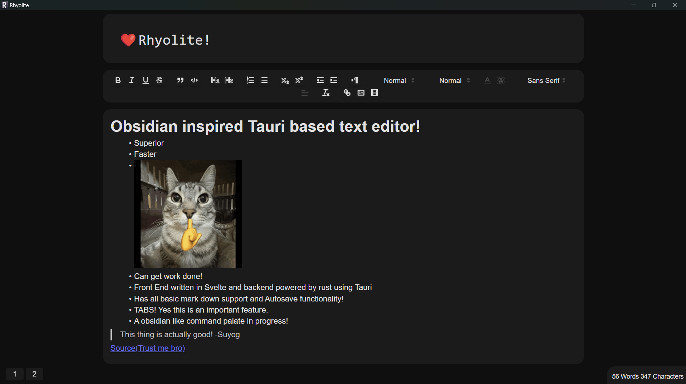
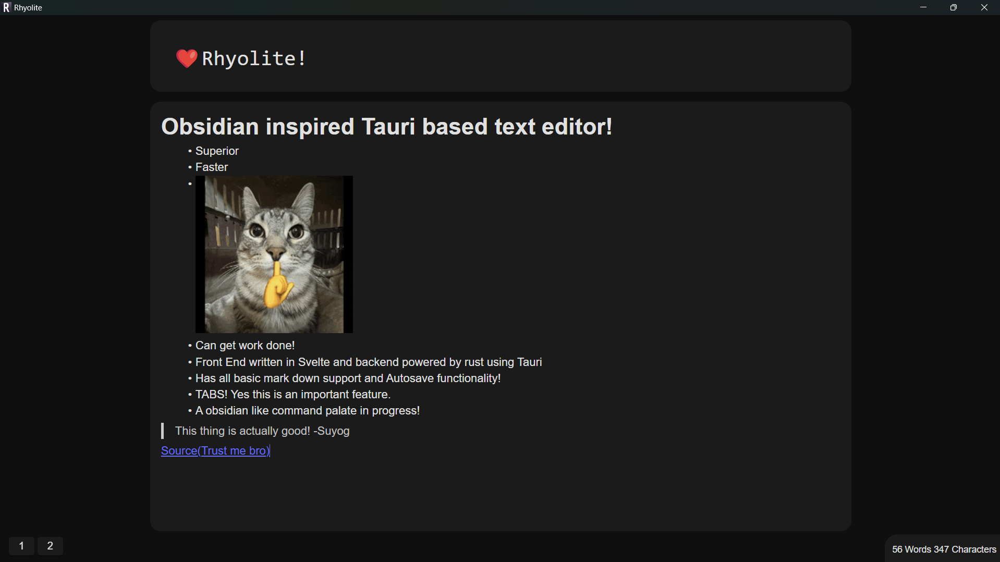

<div align="center">
    
</div>

<h1 align="center">An Open Source Markdown Editor Inspired by Obsidian!</h1>

  


### Rhyolite is a simple markdown editor build using tauri framework that allows user to edit and work on markdown files.


Please note that **major changes are ongoing**. For the most stable experience, wait for a new binary release or compile the source from the `master-v0.1.4-old` branch.


## **Current Updates**

### Changes Underway

- Frontend is being worked on and new features are being added.
- Working on a adding support for more markdowns.
- Project renamed to **Rhyolite**.

> Rhyolite is inspired by volcanic rocks, much like Obsidian. The project is my way to contribute and grow as a developer while sharing something meaningful with the open-source community.


## For New Contributors

1. If you want to contribute to the app, you can work on any of the issues that have not been assigned to anyone.
2. Join our **[Discord server](https://discord.gg/K6FAd8FTma)** to collaborate effectively.

---

## How to Install?

### **Windows**

#### 64-bit Systems

- Use the `Rhyolite_[version]_x64_en-US.msi` or `Rhyolite_[version]_x64-setup.exe` installer from the [Releases section](https://github.com/RedddFoxxyy/Rhyolite/releases).

#### 32-bit Systems

- Use the `Rhyolite_[version]_x86_en-US.msi` or `Rhyolite_[version]_x86-setup.exe` installer.

#### ARM64 Systems (Snapdragon processors)

- Use the `Rhyolite_[version]_arm64_en-US.msi` or `Rhyolite_[version]_arm64-setup.exe`.

---

### **MacOS**

- Use the `Rhyolite_[version]_x64.dmg` for Intel Macs.
- Use the `Rhyolite_[version]_aarch64.dmg` for M-series Macs.

> **Note:** You may encounter issues since the app isn’t signed yet.

---

### **Linux**

#### Universal Linux Installer

Run this command in your terminal:

```bash
curl -f https://raw.githubusercontent.com/rhyolite-org/Rhyolite/master/packaging/linux/install.sh | sh
```

#### Debian/Ubuntu

- Install the .deb package from the Releases section.

#### RHEL/Fedora

- Install the .rpm package from the same section.

#### AppImage/Raw Binary

Make the file executable and run:

```bash
chmod +x Rhyolite_[version]_.AppImage
./Rhyolite_[version]_.AppImage
```

---

### **Manual Compilation**

- To build the app manually, run:

```bash
npm run tauri build
```

- For debugging, add `--verbose`:

```bash
npm run tauri build --verbose
```

> **Note:** You may face errors when using package manager other than NPM.

---

## First Startup

1. Run Rhyolite.exe or compile using npm run tauri build.
2. Open the Command Palette using CTRL + P.
3. Explore the features or refer to our Discord community for guidance.

## Known Bugs

1. Theming might cause visibility issues.
2. Tab icons occasionally glitch.
3. Large numbers of open tabs can distort the title.

---

## Licensing

```
Copyright 2025 RedddFoxxyy

Licensed under the Apache License, Version 2.0 (the "License");
you may not use this file except in compliance with the License.
You may obtain a copy of the License at:

    http://www.apache.org/licenses/LICENSE-2.0

Unless required by applicable law or agreed to in writing, software
distributed under the License is distributed on an "AS IS" BASIS,
WITHOUT WARRANTIES OR CONDITIONS OF ANY KIND, either express or implied.
See the License for the specific language governing permissions and
limitations under the License.
```
